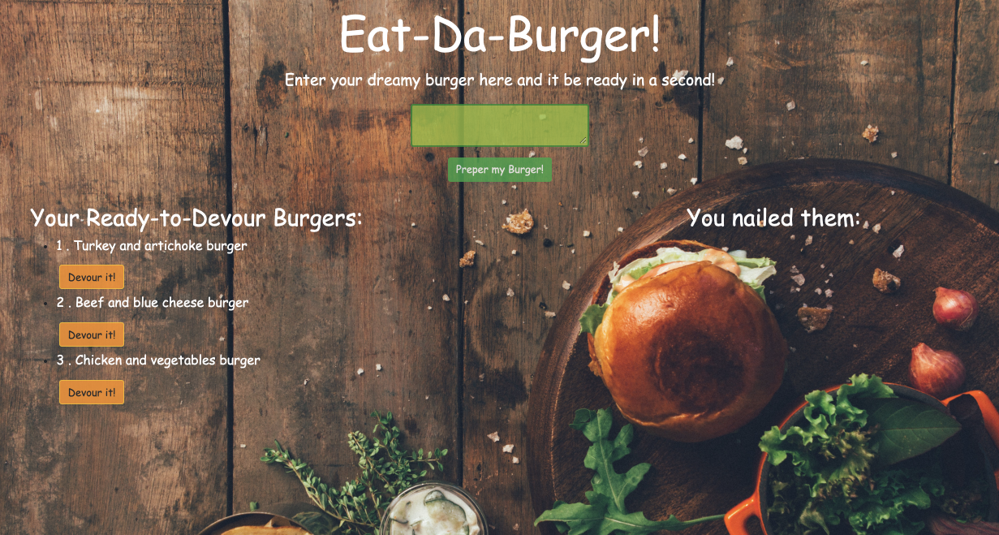

# Eat-Da-Burger_ED
## Overview
- Eat-Da-Burger! is a restaurant app that lets users input the names of burgers they'd like to eat.
- Whenever a user submits a burger's name, the App will display the burger on the left side of the page -- waiting to be devoured.
- Each burger in the waiting area also has a Devour it! button. When the user clicks it, the burger will move to the right side of the page.
- The App stores every burger in a database, whether devoured or not.

### To run the application:
 ```sh
$ node server.js from CLI
```
or using deployed - [Heroku link ](#Link-to-deployed-Heroku-App)


> ## Hightlights:
> - The application uses MySQL database to store all information. 
> - Node and Express for a Back-End side of the App.
> - Handlebars and JavaScript for controlling a Front-End side.


## Visual view of deployed app

<br>

## Link to deployed Heroku App
[EAT-DA-BURGER!](https://intense-taiga-47098.herokuapp.com/)